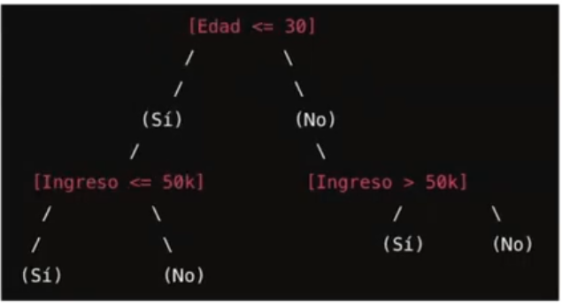

Es un hecho que hoy en día se manejan grandes volúmenes de datos, no solo referente a cantidad de registros sino también a la cantidad de variables o atributos que tienen nuestros conjuntos de datos hoy en día. 

Por tanto, para tener mejores resúmenes o poder desarrollar diferentes técnias es que es se busca alcanzar un reducción de la dimensionalidad. 

## Estrategias de reducción de datos: 

* **Reducción de dimensionalidad**:
    * Remover atributos que no son importantes:
    * Componentes principales (PCA).
    * Pares correlacionados. 
    * Varlmp. 
    * Escalado multidimensional
    * Entre otros

* **Reducción de datos**: 
    * Representar los datos a partir de modelos. 
    * Histogramas, clustering, sampling, 
    Daba cube aggregation, dicretization, etc. 

## Maldición de la dimensionalidad
Este problema conocido como maldición de dimensionalidad es un fenómeno que ocurre cuando el el número de dimensiones en un conjunto de datos es muy grandre en comparación al número de muestras.

* **Espacio de características disperso:** A más dimensiones, más disperso será el espacio de características; por tanto, muestras indiviuales muy separadas y dificulta la identificación de patrones significativos. 

* **Dificultad de visualización.** 

* **Sobreajuste y generalizción pobre**: A más dimensiones, más complejo será el modelo necesario para descrbir los datos. Esto puede conducir al sobreajuster, donde el modelo se ajusta demasiado a los datos del entrenamiento y no generaliza bien a nuevos datos.  (el objetivo de los modelos predictivos es atrapar la generalización de los datos)

* **Costo computacional**: El procesamiento y almacenamiento de datos de alta dimensionalidad es computacionalmente costoso. Muchos algoritmos ML experimentan aumento significativo en el tiempo de ejecución a mayor número de dimensiones. 

* **Reducción de la eficiencia de los algoritmos**: Algoritmos de ML sufren reducción de eficiencia y rendimiento a mayor dimensionalidad. Otras se vuelven inviables o dar malos resultados. 

## ¿Por qué entonces es importante realizar la reducción de dimensionalidad?.
* Evita la maldición de dimensionalidad. 
* Ayuda a eliminar características irrelevantes y reduce el ruido. 
* Reduce el tiempo y espacio necesarios en la extracción de datos. 
* Facilita la interpretación visual. Permitir una visualización más simple de datos. 

Nota: Hay que recordar que siempre que se trabaje con con distintos modelos se compara la calidad de ajuste, la calidad de pronóstico, la parsimonia y la explicabilidad. Se prefiere un modelo simple con una predicción moderada a un modelo muy complejo con una super predicción. 

## Métodologías de reducción de dimensionalidad. 

Nota: a pesar que se presenten distintas metologías para reducir la dimensionalidad es importante entender el negocio pues muchas veces es necesario  mantener una variable de poca variabilidad pues puede ser significativa por más poca información que tenga. 

### Eliminar columnas con datos faltantes (no siempre es la mejor opción): 
* Cuando no es posible realizar imputaciones. 
* Criterio de eliminación: Predominio de datos faltantes. 
    * Por ejemplo, atributos con menos del 5% o 10% de valores. 
* Para todo tipo de variables. 

### Low variance Filter
* Medir varianza de columna para saber cunta información tiene. 
* Varianza 0 implica un valor constante y no sería de ayuda en la discriminación de diferentes grupos de datos. 
* Con low variance filter calcula la varianza para cada uno de los atribuos y remueve aquellos que están por debajo de un umbral. 
* Consideraciones: 
    * Los rangos de columna de datos deben normalizarse para que los valores de varianza sean independientes del rango del domino de la columna. 
    * Para varaibles booleanas de puede usar la Bernoulli. $var(x)=p(1-p)$

### Reducción usando chi-cuadrado $\chi^2$

APLICA A VARIABLES CATEGÓRICAS Y NO-NEGATIVAS como booleanos o frecuencias; por tanto, las continuas se discretizan. Y el objetivo es un modelo de clasificación; es decir, v. respuesta de tipo cualitativo. 

Es una metología relacionada con el test de indepencia chi-cuadrado de cramer. 
Se pueden seleccionar variables con los valores más altos para el estadístico de la prueba $\chi^2$ entre la clase y cada variable. 

La prueba $\chi^2$ mide la dependencia y busca eliminar aquellas variables INDEPENDIENTES de la variable respuesta en la clasificación y en consecuencia son  irrelevantes para el análisis.  

Lo que se verifica es el valor del estadístico V-de cramer.

$$V = \sqrt{\frac{\chi^2}{m*n}}$$
n = cantidad de registros. 
m = $min(filas-1,columnas-1)$
V esta entre 0 y 1
Mas cercano a 1 $\rightarrow$ mayor correlación

### Columnas altamente correlacionadas. 
(colinealidad)
* Atributos correlacionados introducen redundancia al dataset. 
* Atributos redundantes no agregan información y tornan complejo al modelado. 
* Se puede eliminar una de las dos columnas sin dismunuir drásticamente la cantidad de información disponible. 
* El procedimiento consiste en la eliminación de pares correlascionados a partir de la matriz de correlaciones. 
* Método para variables continuas o discretas con coeficiente de correlación de pearson y prueba de $\chi^2$ de Pearson.

Algunas veces, puede suceder que se tenga que trabajar con la multicolinealidad debido a que las variables correlacionadads son importantes para el desarrollo. 

1. Se define un umbral de correlación. 
2. Se seleccionan pares de valores mayores al umbral. 
3. El criterio es conservar la variable que en el resto de las correlaciones sea en promedio menor. Que la otra

### Variables importantes (Random Forest)
Con el algoritmo de machine de random forest hay una posiblidad de ver que variables son importantes y cuales no.

* Son productos derivador de la salida de un modelo de ensambre Random Forest (RF).
* La inducción de árboles de decisión involucra la utilización de medidas internas de importancia. 
* RF realiza un muestreo de variables para cada árbol y mide la importancia de cada variable para esa muestra. Al finalizar calcula la importancia promedio de cada variable a aprtir de todas las muestras en las que salió seleccionada.

se construyen muchos árboles con muestras distintas y en cada iteración se mide la importancia a cada varible para explicar un problema en específico.

Un Random forest (bosque aletorio) es un algoritmo de aprendizaje automático utilizado tanto para tareas de clasificación como de regresión. Construye múltiples árboles de decisión durante el entrenamiento y combinar sus resultados para obtener una predicción más precisa y robusta. 

**Creación de árboles de decisión**: Un Random forest construye muchos árboles de decisión. Cada árbol se construye utilizando una muestra aleatoria de los datos de entrenamiento y una selección aleatoria de caractarísticas en cada nodo del árbol. Esta aleatorización ayuda a que los árboles sean menos correlacionados entre sí. 

**Muestreo Bootstrap**: Para cada árbol en el bosque, se usa un conjutno de datos de entrenamiento diferente, obtenido mediante el método de muestreo bootstrap. Esto significa  que para cada árbol se selecciona aleatoriamente una muestra con reemplazo del conjunto original. 

**Selección aleatoria de características**: en cada nodo de un árbol, solo un subconjunto aleatorio de las características se considera para la división. Esto introduce más diversidad entre los árboles y ayuda a evitar el sobreajuste. 

**Predicción**:
*Para clasificación: Cada árbol da una "votación" sobre la clase a la que debería pertenecer una muestra. La clase final se determina por mayoría de votos.

*Para regresión: La predicción final se calcula promediando las predicciónes de todos los árboles 

ejemplo: se quiere clasificar si un cliente comprará un producto basado en su edad y el ingreso. 

RAÍZ Si la edad es menor a 30: 
si: pasa al siguiente nodo.
No: El cliente no compra. 

NODO INTERNO Si el ingreso es 30 años o menos:
Si: comprará el producto
NO: No comprará el producto

NODO TERMINAL:
Si: comprará el producto
NO: No comprará el producto

La **importancia de las características** se refiere a qué tan valiosa es cada característica para hacer prediciones. Esto se calcula automáticamente en el proceso de entrenamient y se hace usando métodos basados en çomo las características afectan la calidad de las divisiones en los árboles del bosqué. 

#### Importancia Basada en la Reducción de Impureza. 
Este método es el más común y se basa en la cantidad de reducción de impureza(**o variabilidad**) que una característica propociona en los árboles de decisión Random Forest. La impureza puede ser medida por índices como **entropía en la clasificación** o la **varianza en la regresión** o el índice gini también usada en clasificación como medida de impureza. 

*Reducción de Impureza en un Nodo: En cada división de un árbol de decisión, el algoritmo evalúa qué tan buena es la división en función de la reducción de impureza que produce. La importancia de una característica se calcula como la suma de las reducciones de impureza ponderadas que esa característica contribuye a través de todas las divisiones en todos los árboles del bosque. 

*Cálculo: Para cada característica, se suman las reducciones de la impureza que la característica contribuye a lo largo de todos los nodos y árboles en el bosque. Luego, esta suma dse promedia y se normaliza para obtner la importancia relativa. 

### Eliminación backward, fordward y stepwise(como se vio en regesión)
#### Backward:
* Realiza un loop y usa un algoritmo de aprendizaje para medir cómo disminuye el error al quitar algún atributo.

* Comienza con el conjunto completo de atributos. 

* En cada paso, elimina el peor atributo que queda en el conjunto.

* la principal desventaja de esta técnica es el alto número de iteraciones para datasets con gran dimensionalidad, generalmente esto conduce a tiempos de computo elevados. 

#### Forward
* El procedimiento comienza con un conjunto vacío de atributos como conjunto de reducción. 

* El mejor de los atributos originales se determina y agrega al conjunto de reducción. 

* En cada iteración o paso posterior, el mejor de los atributos originales restantes se agrega al conjunto.

se hacen todas las combinaciones posibles de las variables, inluso se comienza con una sola variable  y se selecciona la de menor MSE. 

### Análisis de componentes principales PCA
* Encuentra una proyección que captura la mayor varaiblidad posible de los datos. 

* Los datos originales se proyectan en un espacio mucho más pequeño, lo que resulta en la reducción de dimensionalidad. 

* Buscamos los autovectores de la matriz de covarianza, y estos autovectores definen el nuevo espacio. 

Técnica usada para reducir la dimensionalidad de un conjunto de datos, manteniendo la mayor cantidad posbile de variabilidad o información. Se generan los componenetes principales como combinación lineal de las variables principales usando los valores y vectores propios para que las combinaciones lineales capturen la mayor variabilidad posible.

Pasos: 

1. **Estandarización de los datos**: Para que cada variable tenga media 0 y varianza 1. Muy importante si las variables tiene diferentes escalas pues el PCA es sensible a escalas variables. 

2. **Calculo de la matriz de covariazna de los datos ESTANDARIZADOS**: la matriz mide como varían juntas las variables. 

3. **Cálculo de valores y vectores propios**: Los vectores propios determinan la dirección donde se maximiza la variabilidad mientras que los valores propios indican la cantidad de varianza en cada componente principal.

4. **Ordenación y Seleción de componentes princpales**: Los vectores propios se ordenan de mayor a menor y la idea es elegir la menor cantidad posible pero que maximizen la variabilidad.

5. **Transformación de datos**: Los datos originales se proyectan sobre los componentes principales seleccionados para obtener un conjunto de datos de menor dimensión. 

Hay tantos componente principales como variables, pero pues cada vez la variabilidad explicada es menos por lo que solo se escogen los de mayor variablidad; idealmente que alcancen una variabilidad acumulada almenos de un 75-80%

lo dificíl es que ahora los ejes pierden explicabilidad tanto porque se transformaron los datos, como que son una combinación de las variables que son las que se pueden explicar. 

