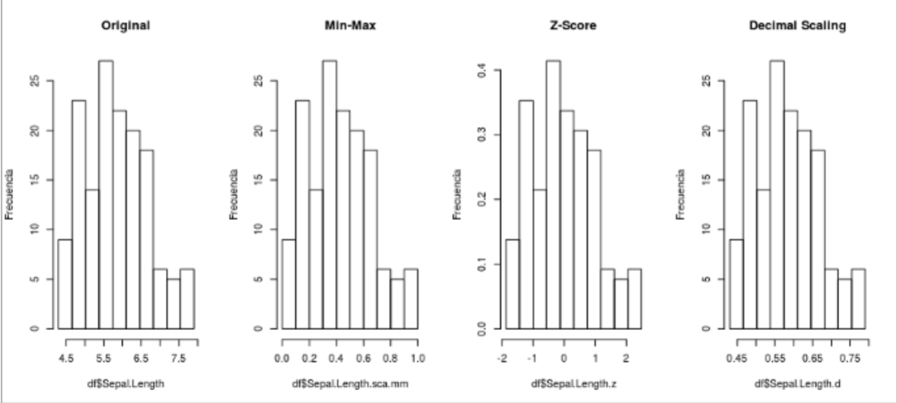
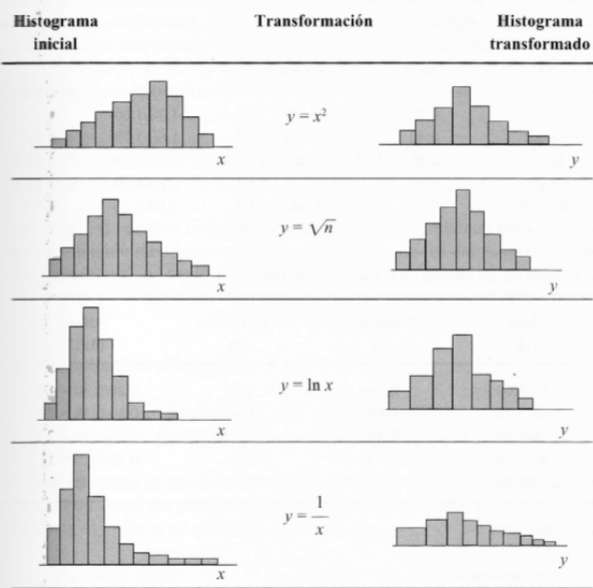
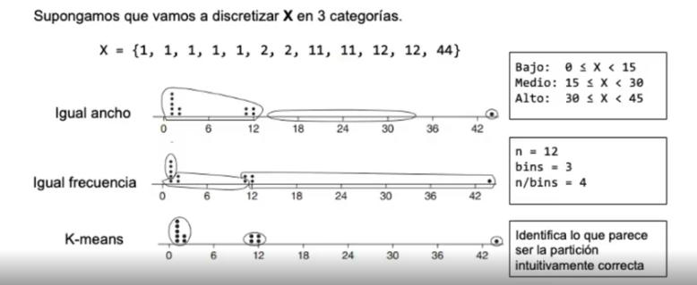

Clase del 7 de mayo. Todo lo que se presenta en estas notas es lo mismo que hay en las dispositivas más ideas adicionales que se dieron durante la clase. 

# Ingeniería de Características (Feature Engineering)

Es el ejercicio de hacer transformaciones y contrucción de variables nuevas a partir de las variables originales con el fin de mejorar el desempeño de mis modelos, muchas veces por ejemplo cambiar el dominio de mis variables y mejorar el desempeño de mi modelo o mejorar la interpretabilidad entre mis variables y la variable respuesta. 

Ejemplos de transformaciones: 
* Discretización. 
* Normalización
* Binning

Ejemplos de casos de uso: 
* En algunos casos que se usan unos algoritmos específicos de machine learnging, estos piden que los datos estén ESCALADOS - valores entre 0 y 1 o -1 y 1 - pues porque al ser algoritmos de distancias pueden tener diferentes pesos por esa diferencias de escalas y generar sesgos.

* Dentro del KDD que es el Proceso de Descubrimiento de Conocimiento se corresponde con la etapa de transformación de datos.

    * La transformación de datos engloba, en realidad, cualquier proceso que modifique la fora de los datos. 

    * Prácticamente todos los proceso de preparación de datos entrañan algún tipo de transformación. 

La principal tarea del Feature Engineering es la tarea de mejorar el rendimiento del modelado en un conjunto de datos mediante la transformación de su feature space (llevar le dominio del conjunto de características a un nuevo domino para ayudarme a mejorar ese desempeño). 

## Herramientas para la ingeniería de características

### 1. Normalización ---
La normalización consiste en escalas los features (numéricos) de manea que puedan ser mapeados a un rango más pequeño. 

Por ejemplo: (0 a 1) ó (-1 a 1). 

La normalización es particularmente utilizada en: 

* Tareas de data mining donde las unidades de medidas dificultan la comparación de features. 

* Medidas de Distancias. Vecinos más cercanos, clustering, etc. Pues ayuda a evitar que atributos con mayores magnitudes tengan un mayor peso que los rangos pequeños. 

Los métodos más utilizados para normalizar son: 

**1. MIN-MAX**

**2. Z-SCORE (también sirve para la identificación de datos atípicos)**

**3. DECIMAL SCALING**

#### 1. Normalización MIN-MAX
Lo que hace esta normalización es analizar la variable numérica con la que se esta trabajando y encontrar el valor mínimo y máximo para esta variable y la nueva variable TRANSFORMADA es : 

$$X^*_{mm}= \frac{X - min(X)}{range(X)} = \frac{ X -min}{max(X)-min(X)}$$

Y por la forma que se tiene, entonces los valores de esta normalización **VAN DE 0 A 1**.

Este método requiere conocer el mínimo y el máximo, y que estos datos sean los mismos tanto para el entrenamiento del modelo como para el test de este. Pues, si se llega a tener un valor máximo y mínimo diferentes puede generar malas predicciones y por ende malas métricas. (Si el testeo tiene valores más granges, seguramente se caerá el desempeño)

CONCEPTO IMPORTANTE
**PSI (Population Stability Index)**: Es una métrica que establece la similitud entre la distribución de una variable X en el entrenamiento con ella misma en el test; es decir, simplemente mide que las distribuciones sean similares. Si las distribuciones cambian drásticamente el modelo no va a servir pues este solo entiende una distribución específica, con la que se entrenó. (ESTO ÚLTIMO ES LO QUE SE CONOCE EN LA PRÁCTICA COMO QUE EL MODELO SE DESCALIBRÓ y se debe volver a hacer o re-entrenar pues hay un cambio en la distribución de los datos)

#### 2. Normalización Z-score
Como vimos anteriormente en el análisis de datos atípicos. Los valores para una variable $X$, se normalizan en base a la media y desviación estandar de $X$:

$$Z-score = \frac{X - mean(X)}{sd(X)}$$

Se crea una nueva variable Z que tiene los valores de X transformaddos con esa fórmula.

Si la distribución de los datos es simétrica, se moverá entre -3 y 3 aproximadamente. Pues es llevar a que los datos tengan una distribución N(0,1). En caso que la distribución sea bastante asimétrica usamos el Z-score modificado que usa estadísticos robustos a los datos atípicos como mediana y el mad.  

#### 3. Normalización Decimal Scaling
Decimal Scaling asegura que cada valor normalizado **se encuentra entre -1 y 1**. 

$$X_{decimal} = \frac{X}{10^d}$$

Donde $d$ representa el númerod de dígitos en los valores de la variable con el valor absoluto más grande.

Por ejemplo, si tengo una variable con los números del -99 hata el 99, el número de dígitos en los valores de la variable con el valor absoluto más grande sería 2, $10^2=100$ y cada número entonce se divide entre 100. 

$$\frac{99}{100}=0.99$$ $$\frac{-99}{100}=-0.99$$

Notese que estos métodos no cambian nada en la distribución, conservan el sesgo, la variabilidad y toda su característica, lo único que cambia es directamente la escala de los datos. 

### 2. Escalados Robustos

* Para data frames con muchos valores atípicos, un escalado usando la media y la varianza de los datos no funcionará muy bien. 

* En est caso se puede usar un método robusto como reemplazo. 

* usan estimaciones más sólidas para el centro y el rango de sus datos. 

* Por ejemplo: Mediana (o algún percentil) e IQR.

Un escalado robusto es por ejemplo el **Z-score modificado**

### 3. Técnicas para lograr normalidad.

Con los escalados que acabamos de ver sabemos que la distribución no cambia, pero hay casos que es necesario cambiar la distribución para que sea más simétrica. 

En casos de algoritmo paramétricos que tengan como supuesto la distribución normal, esto puede ser una gran ayuda. 

$$sesgo = \frac{3*(media - mediana)}{desviación}$$

* Si la media es mayor a la mediana hay sesgo positivo (a la derecha). 

* Si la media es menor que la mediana entonces hay sesgo negativo (a la izquierda).

Entonces hay un tipo de transformaciones para reducir este sesgo y tratar de convertir la distribución de la variable un poco más simétrica:

(para variables positivas)
* 1. Raíz cuadrada. 
* 2. Logaritmos.
* 3. Inversa de la Raíz Cuadrada.

Aunque si se esta usando un algoritmo no paramétrico que no necesita la normalidad pues directamente es mejor usarla original. 

No se trata de normalizción en el sentdio de llevar a una escala específica sino másb bien llevarla a que se parezca a una distribución normal, simétrica. 

### 4. Discretización NO supervisada

* Es una técnica sencilla pero demasiado útil y es dividir el rango de una variable continua en intervalos. 

* Es llevar una variable continua a que sea categórica. 

Ahora, ¿Como establecer estos rangos de discretización?

#### 1. Discretización Binnig.
Comienza con el conjunto de datos completo y luego divide ese rango en intervalos discretos. Se basa en una visión general de los datos y la definición de intervalos que abarcan todo el rango de valores posibles. 

* Es top-down: va de 

* Se basa en un número específico de cortes. 

* Los criterios de agrupamiento pueden ser por: 
    * Igual frecuencia: igual cantidad de observaciones. 
    * Igual ancho: se definen rangos o intervalor para cada uno de los agrupamientos.
* Se hacer el reemplazo de los datos por la **media** o la **mediana** o una **etiqueta**

* **Proceso:** Primero se decide el número de intervalos o cagorías. Luego se divide el rango total de los datosa en esos intervalos. Estos intervalos pueden ser iguales en tamaño o pueden ser definidos en función de criterios específicos y cada dato se asigna al intervalo correspondiente.

*No se usa información de la clase y por tanto es no supervisado. 

* Es muy sencillo pero no captura bien la variabilidad y es menos flexible. 

#### 2. Discretizaicón Bottom-up. 
* Comienza con los datos individuales y luego agrupa estos datos en intervalos o categorías. Se basa en la estructura y distribución de los datos en lugar de imponer una divisón predefinida.

* **Proceso:** Se analiza la distribución de los datos para identificar patrones, grupos o patrones NATURALES. A partir de esta información se definen los intervalos o categorías de manera que reflejen mejor la estructura subyacente de los dos y cada datos e agrupa enel intervalo que mejor representa su dato. 

* Caputra mejor la distribución real de los datos y es muy flexible pero puede ser más complejo de implementar.

#### 3. Discretización Rank
Donde el ranking de un número es su tamaño relativo a otros valores de una variable numérica. Primero se ordena la lista de valores, luego se asigna la posición de un valor como su rango. 

Los mismos valores reciben el mismo rango pero la presencia de duplicados afecta a las filas de valores posteriores.

Rango es un sólido método de binnig con un inconveniente importante, los valores pueden tener rangos diferentes en diferentes listas. Y pues habrán tantos rangos como valores diferentes por lo que si hay muchos valores diferentes entonces pues sería una perdida de tiempo. 

#### 4. Discretización quantiles
También son métodos binning muy útiles pero como Rank, un valor puede tener cuantil diferente si la lista de valores cambia. 

#### 4. Discretización con funciones matemáticas
Por ejemplo tomar la parte entera del logaritmo de los datos, FlOOR(log(X)) es un método binning efectivo para las variables numéricas con distribución altamente sesgada como el ingreso. Y es una buena forma de etiquetar.

### 5. Discretización Supervisada

Ahora veremos métodos necesitan verificaciones de que los cortes que se hacen estan bien. 

#### 1. Discretización basada en Entropia.

La **entropía** es una medida de la incertidumbre o el desorden en un conjunto de datos. En el contexto de la teoría de la información, se usa para cuantificar la cantidad de información contenida en un conjunto de datos.

**Para variables discretas**
Para una variable discreta Y con clases $C_1$,$C_2$,$C_3$,...,$C_k$. La entropía se define como : 

$$H(Y)=-\sum_{i=1}^k p(C_i)log_2p(C_i)$$

Donde $P(C_i)$ es la probabilidad de la clase i.

¿Por qué esa formula?

**Para variables continuas**
* La idea es discretizar en función de la entropía encontrada para encontrar los puntos de corte óptimos. Primero, se deben probar diferentes puntos de corte en el rango continuo y calcular cómo afecta la entropía. 

* Para cada posible punto de corte $t$, divide el rango continuo en dos intervalos $(-\inf, t],(t,\inf)$. Luego calcula la **entropía condicional** para cada intervalo: 

    * Entropía intervalo 1: $H(Y|X<=t)$
    * Entropí intervalo 2. $H(Y|X>t)$

Donde $X$ es la variable continua que se está discretizando y $Y$ la variable objetivo o respuesta. 

* Calcula la entropía total después de la discretización utilizando el punto de corte $t$. Esto se hace sumando las entropías ponderadas de los intervalos resultantes

$$H(Y|X \text{después de la discretización})=P(X<=t)*H(Y|X<=t) + P(X>t)*H(Y|X>t)$$

donde $P(X<=t)$ y $P(X>t)$ son las proporciones de datos que caen en los intervalos.

* Luego compara la entropía total calculada para cada punto de corte. El mejor punto de corte es aquel **que minimiza la entropía total** después de la discretización, lo que indica que la división proporciona mayor ganancia de información (osea, la mayor capacidad de distinguir entre diferentes clases). Como es una medida de incertidubmre, a menor incertidumbre, más explicabilidad y eso es lo que se quiere. 

Nota: en el algoritmo de árboles de decisión los puentos de corte se hallan de la misma manera minimizando al entropía y maximizando la cantidad de información explicada. 

* Es supervisada y separación top-down (lo que hace es que se ponene puntos de corte y se van testeando).

* Explora la distribución de información en la clase para el cálculo y determinación del split-point.
* Para un dataset D $\rightarrow$ {$A_1$,$A_1$,...,$A_N$} el método para discretizar $A$ es:

1. Cada Valor de A se considera como un posbile split-point para haccer una discretización binaria. 

2. Calculo la Entropía para la Clase. 

$$H(S) = \sum - p_i*ln(p_ig)$$

3. Calcula la **Entropía** par a la calse y el split-point a evaluar.

$$H(S,A) = \sum \frac{|S_v|}{|S|}H(S_v)$$

4. Cálculo **information Gain** para esta partición, como:

$$InformationGain = H(S) - H(S,A) = Entropia sin hacer cortes - entropía total después del corte$$

### 5. Recodificación de variables.

* Algunos métodos analíticos, como la regresión, requieren que los predictores sean numéricos. 

* Cuando tenemos descriptores categóricos, podemos recodificar la variable categórica en una o más variables Dummy o Flags o One-Hot enconding.

### 6. Índice Gini

**Es como el equivalente a la entropía para las veces cuando la varibles respuesta es numérica.** 

en el contexto de árboles de decisión este índice mide la impureza de un nodo en el árbol. El objetivo es encontrar la división en los datos que minimicie el índicde de Gini, logrando así nodos más puros y homongéneos. La fórmula del índice de Gini para un nodo es : 

$$G = 1- \sum_{i=1}^k p_i^2$$

donde $p_i$ es la proporción de datos en el nodo que pertenecen a la case $i$. $K$ es el número total de clases. 

En todos aquellos problemas de segmentaciónes es que se buscan estos tipos de corte ya que pueden ayudar de una manera significativa a la identificación de los partrones para la variable respuesta. 

