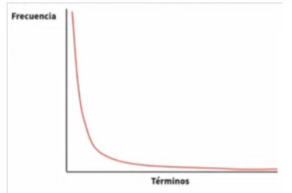

# Datos no estructurados y representación de texto

## ¿Qué son los datos estructurados y cómo convertimos un texto en algo que una máquina puede analizar?

### Dos mundos de datos: Datos estructurados y no estructurados

#### Datos estructurados:
* Arreglos de datos ordenados en filas y columnas, con elementos bien definidos y claros al igual que las bases de datos relaciones que son tablas hechas de registros y se relacionan entre sí y requiere mucho trabajo para recuperarlos y curarlos. Hay correlaciones, medidas, etc. 

#### Datos no estructurados. 
* son datos que no tienen un modelo predefinido de filas y columnas. Algunos ejemplos son: texto, imágenes, audio, video, hay estructura pero es oculta y hay que extraerla. La mayoría de datos que se usan día a día son NO estructurados. 

## Minería de texto (no se verán imagenes, audio, videos, etc)
**Extraer info útil con algoritmos estadísticos**. Antes llevamos a cabo un pre-procesamiento.

## ¿Como se representan los textos? TOKENIZACIÓN
Son unidades mínimas llamadas tokens (normalmente palabras), esto es lo principal ya que llevar un texto a tokens es la primera parte para poder hacer minería de texto y así las palabrás hacen de variables en nuestros datos. 

ejemplo: 

"this is a sample" $\rightarrow$ ["this] ["is"] ["a"] ["sample"]

## Normalización y palabras vacías
Relizar un tipo de limpieza como la estandarización o normalización pero a nuestros datos que ahora son texto.

### Técnicas habituales:
* Expresions regulares para extraer fechas, URLs, correos.

* Pasar todo a minúscula.(normalización)

* Detección de Entidades. (Identificar nombres propios, nombres de ciudades, identificación de cosas particulares, etc)

* Eliminar palabras vacías (stropwords): "de", "la", "que", "un", "una". No representan muchas cosas y esto representa un tipo de reducción de dimensionalidad.

* Steming: Computer, computing, compute, computation. Tomar palabras que tengan una misma raíz eurística.

**Ley de Zipf**: la frecuencia de un término es inversamente propocional a su rango. Unas pocas palabras (de, la que, un) son las más frecuentes y las menos informativas. 

  

## Corpus, lexicón y bolsa de palabras
**Corpus**: Un conjunto de documentos en texto plano. (páginas web, noticias, tweets, publicaciones,...). Es básicamente todo el conjunto de datos límpio sin analizar. 

**Lexicón**: El conjunto completo de palabras DISTINTAS que aparecen en el corpus, para analizar las frecuencias teniendo encuenta la ley de zipf. 

**Bolsa de palabras (Bag of Words)**: 
* El orden no importa: solo cuántas veces aparece cada una. 
* Las palabras se tratan como dimensiones(features) y sus valores las frecuencias de ocurrencia. (si, cada palabra como variable.)
* Es una representación o visulazación descriptiva para entender de que se esta hablando en un corpus, la tésis. Y es fundamental para el procesamiento de lenguaje natural que se usa para representar documentos textuales de tal manera que una máquina la pueda entender. 

## Matriz término-documentos
Es una forma de representar la palabras del texto como una tabla de números: filas=documentos, columnas=términos. 

Las filas representan las unidades de estudio (los documentos) de texto que se analizarán, y las columnas de la matriz representan los términos del texto que se utilizarán en el análisis. 

| | tango | baile | popular | vendido | sueldos |
| :--- | :---: | :---: | :---: | :---: | :---: |
| **D1:** El tango es un baile popular | 1 | 1 | 1 | 0 | 0 |
| **D4:** Con el Tango líquido los sueldos | 1 | 0 | 0 | 0 | 1 |
| **D5:** El Tango 01 fue vendido | 1 | 0 | 0 | 1 | 0 |

Notese que en la fila se tiene cada uno de los documentos y las columnas cada una de las palabras informativas donde los elementos se llenan con las frecuencias de cada palabra por documento. 

## Representación documentos de texto

### Modelo Bolsa de Palabras
Es una técnica fundamental en el procesamiento de lenguaje natural que se usa para representar documentos textuales de una manera que las máquinas puedan entender.

* El orden de las palabras no importan. 
* ¿Cuál es la probabilidad de sacar la palabra tango de la bolsa? (de un documento con la palabra tango)

En el contexto de un problema de aprendizaje las palabras se tratan como dimesiones y sus valores son las frecuencias de ocurrencia. El modelo de bolsa de palabras es directamente la representación matricial de los documentos. 

LA MATRIZ TÉRMINO-DOCUMENTO ES LO MISMO QUE LA BOLSA DE PALABRAS. 

### Palabras que no ayudan

* Modelos de bolsa de palabras: muchas palabras frecuentes no ayudan. (El hecho de que una palabra tenga una frecuencia alta no quiere decir que sea importante o informativa)
* Podemos remover esas palabras de la bolsa. 
* Esos términos son llamados: **stopwords** o **palabras vacias**
* Hay librerías con conjuntos de stopwords para cada idioma. 
 

## Stemming y lematización
Es lo último que se puede usar para reducción de dimensionalidad.

#### Steemming: 
Cortar una palabra a una raíz heurística, aunque alguans veces no puede servir ya que a la raíz que se lleve puede no tener significado, aunque es muy rápido. 

| Form | Suffix | Stem |
| :--- | :--- | :--- |
| studies | -es | studi |
| studying | -ing | study |
| niñas | -as | niñ |
| niñez | -ez | niñ |

#### Lematización. 
Directamente usa la categoría gramatical el lema, que es la raíz válida de las palabras que se están estudiando y son bastante específicas del idioma.

Devuelve una palabra base sólida. Dependen del lugar del discurso y son altamente específicas del idioma.

ejemplo: las palabras, correr, corriendo, corren stemming puede llevar a la raíz "corr" que no tiene mucho sentido de una manera bastante rápida, pero lematización puede llevarme al lema "correr". 

Ambas técnicas ayudan al proceso de reducción de dimensiones de la matriz agrupando las palabras de la misma familia en un solo término. 

## Frases como un solo término: entidades
El reconocimiento de entidades es una técnica fundamentel  dentro del procesamiento de lenguaje natural que se encarga de identificar y clasificar elementos específicos dentro de un texto.

Estos elementos, llamados entidades pueden ser: personas, ubicaciones, fechas, cantidades, etc. 

Imagina que tienes un montón de reseñas de productos. El reconocimiento de entidades te permitiría identificar automáticamente los nombres de los productos, las marcas y las opiniones de los usuarios. Esto sería muy útil para realizar análisis de sentimiento, estudios de mercado o para crear sistemas de recomendación

### Reconocimientod de entidades
identificar y clasificar expresiones que refieren a personas, organizaciones, lugares, marcas, fechas o medidas. Es una subtarea de la extracción de información.

### POS tagging
(etiqueta morfosintáctica): asignar a cada palabra su categoría gramatical (sustantivo, verbo, adjetivo, ...) Es un paso precio antes de muchas tareas de PLN.

* **Sustantivo**: Palabras que nombran seres, objetos, lugares o ideas (ej. *tango*, *baile*, *niña*).
* **Verbo**: Palabras que expresan acciones, estados o procesos (ej. *es*, *fue*, *estudiar*).
* **Adjetivo**: Palabras que modifican o describen cualidades de un sustantivo (ej. *popular*, *líquido*, *vendido*).
* **Adverbio**: Palabras invariables que modifican a un verbo, adjetivo u otro adverbio (ej. *no*, *muy*, *ayer*).
* **Determinante**: Artículos y posesivos que delimitan el alcance del sustantivo (ej. *el*, *un*, *los*).
* **Pronombre**: Palabras que sustituyen al sustantivo para evitar su repetición (ej. *él*, *eso*, *que*).
* **Preposición**: Palabras que relacionan elementos dentro de una oración (ej. *con*, *de*, *en*).
* **Conjunción**: Nexos que unen palabras u oraciones (ej. *y*, *o*, *pero*, *porque*).
* **Nombre propio**: Sustantivos que designan a un ser o entidad única (ej. *Tango 01*).
* **Interjección**: Expresiones que equivalen a un enunciado exclamativo (ej. *¡hola!*, *ay*).

## Otras tareas del procesamiento del lenguaje Natural
**Part-of-speech-tagging (etiquetado morfosintáctico)**

Técnica fundamental en el PLN que consiste en asignar a cada palabra de una oración una etiqueta que indica su categoría gramatical. 

¿Para qué sirve?

* Análisis sintáctico: Es el primer paso para comprender la estructura gramatical de una oración y las relaciones entre palabras. 

* Análisis semántico: Ayuda a determinar el significado de las palabras en el contexto de una oración.

Es un tarea previa que hace un modelo de lenguaje para la traducción automática, resúmen de texto, generación de lenguaje natural y análisis de sentimientos. 

Ejemplo: 

El tango es un baile pupular
Escuchar tango es placentero
Gardel es un gran valor del tango
Con el Tango liquido los sueldos
El Tango 01 fue vendido

Pasa a: 

El_NNP tango_NNP es_VBZ un_JJ baile_NN pupular_JJ Escuchar_NN tango_NN es_VBZ placentero_NN Gardel_NNP es_VBZ un_JJ gran_JJ valor_NN del_DT tango_NN Con_NN el_NN Tango_NNP liquido_NNP los_VBZ sueldos_NNS El_NNP Tango_NNP 01_CD fue_NN vendido_NN

